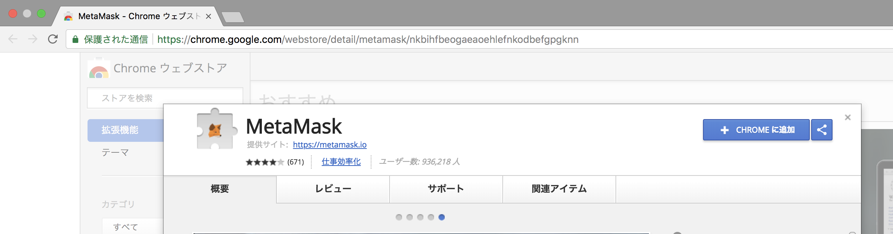
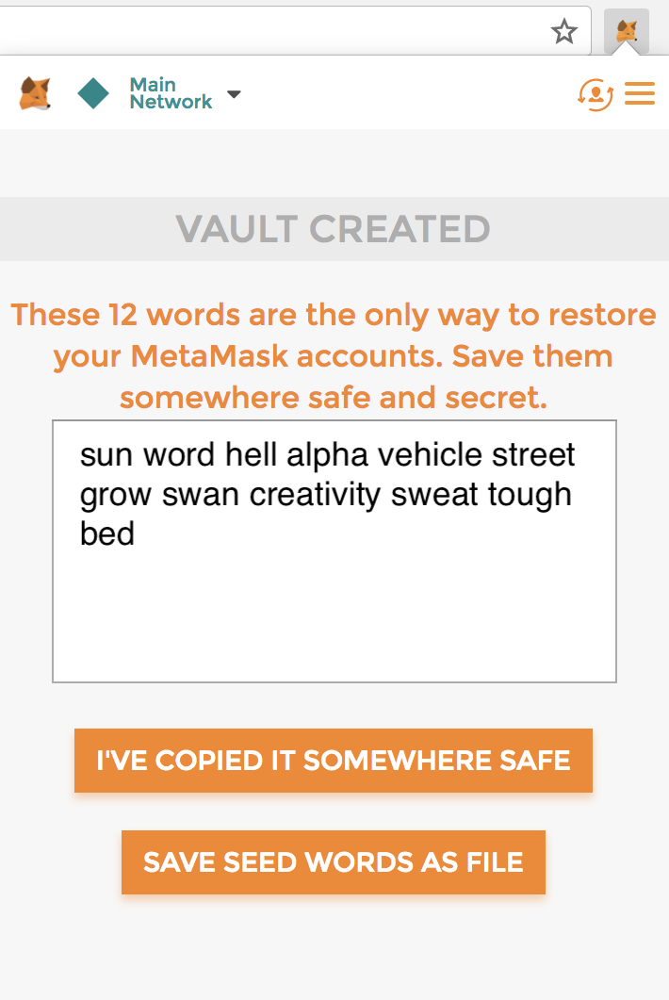
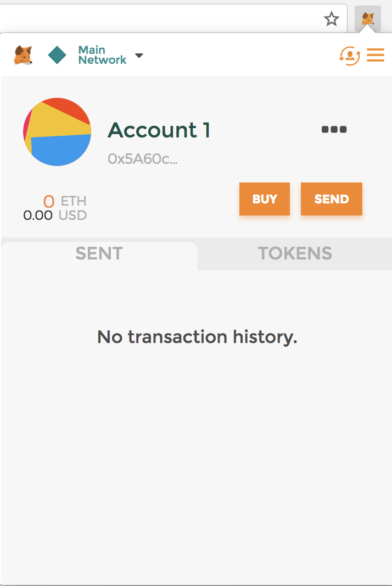
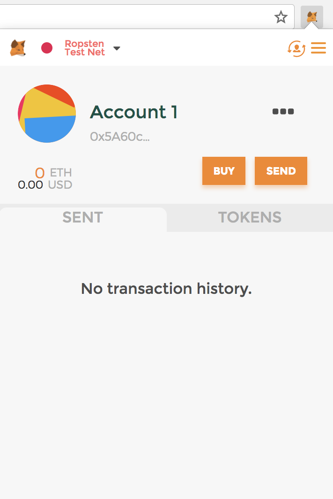
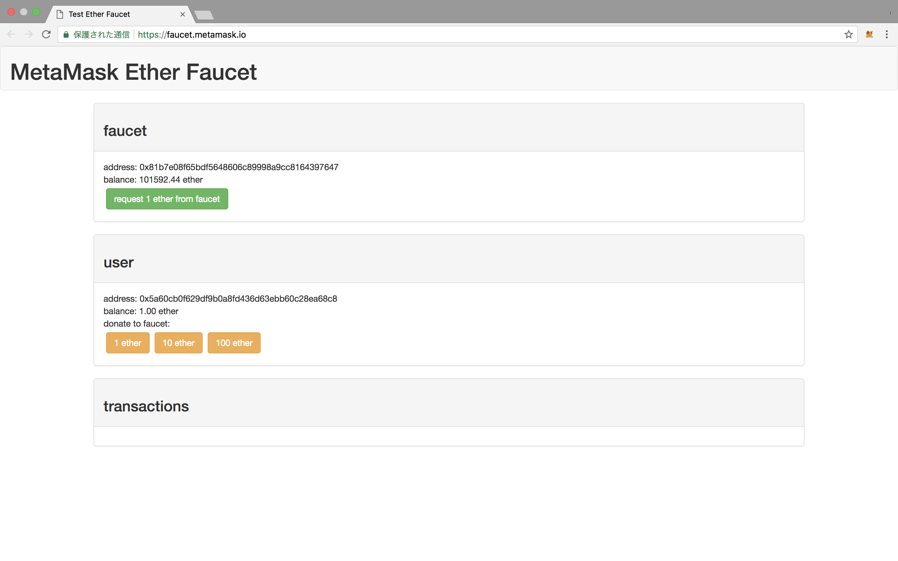
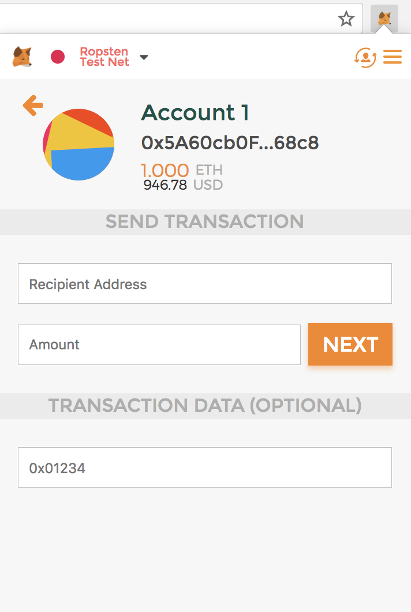
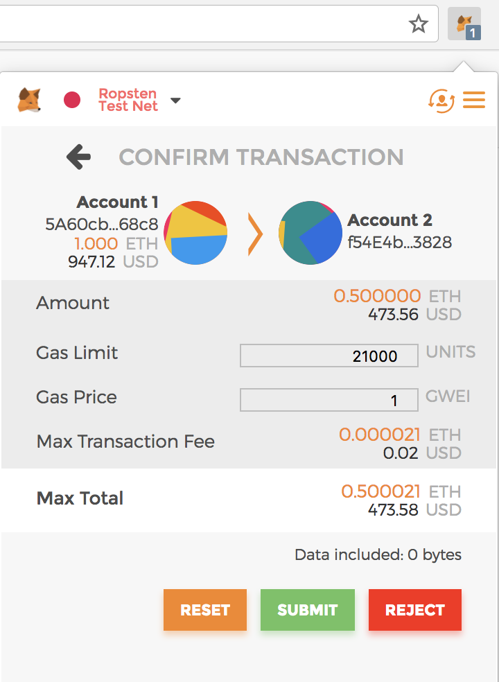
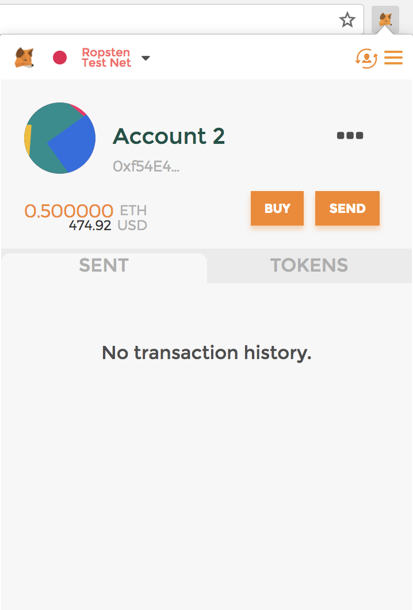
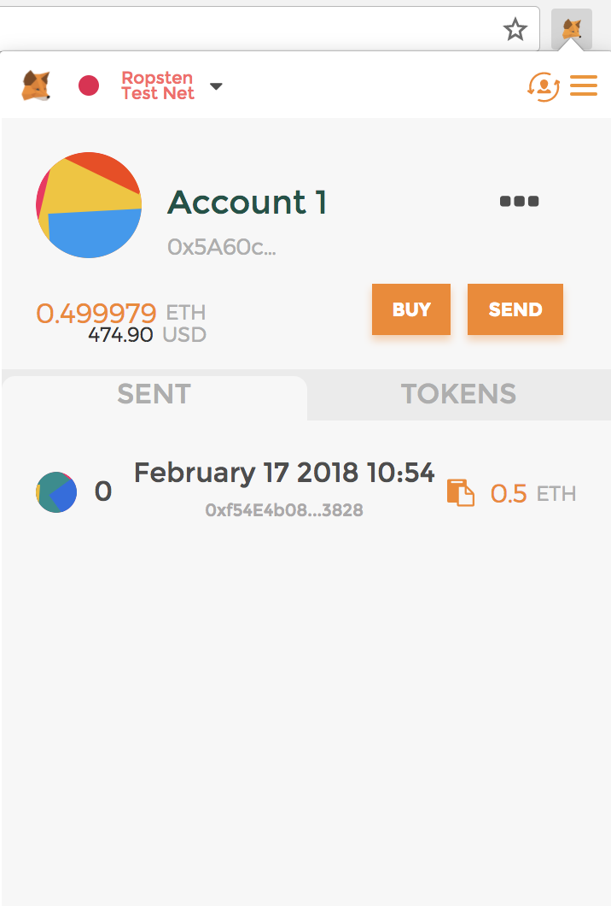

# Ethereum ウォレットの使い方（Metamask）

Ethereum（イーサリアム）を利用する最も簡易な方法はウォレット（wallet）を利用するものです。ウォレットは「財布」を意味し、仮想通貨であるEtherを保持・送金を可能にするものです。また幾つかのウォレットではスマート・コントラクトの実行も可能です。ウォレットは現在までに数多くリリースされており、以下に代表的なウォレットを示します。

* **MyEtherWallet（**[**公式サイト**](https://www.myetherwallet.com/)**）**：WebベースのEhtereumウォレットです。Webベースとはいえ、アドレスやその秘密鍵は外部サーバに保存されるわけではなく送金処理なども全てブラウザ上で動作します。秘密鍵等が外部に送信されることがないため、比較的安全に利用できます。多くの機能があり、Ethereum上のdAppのTokenの送受信も可能です。
* **MetaMask（**[**公式サイト**](https://metamask.io/)）：chrome拡張機能で利用できるウォレットです。このウォレットもアドレスやその秘密鍵は外部サーバに保存されるわけではなく送金処理なども全てブラウザ上で動作します。
* **Mist（**[**公式サイト**](https://ethereum.org/)）：Ethereumプロジェクトの公式ウォレットです。デスクトップクライアントとして動作します。
* **Trezor（**[**公式サイト**](https://trezor.io/)**）**：上記２つのウォレットは「ソフトウェア」ウォレットであるのに対して、このTrezorはハードウェア・ウォレットと呼ばれ筐体を持つデバイスの形をしたウォレットです。ウォレット内の仮想通貨を送金する際などに、PCに接続して利用しますが、それ以外の場合はPCから外しインターネットから完全に遮断された状態にすることが可能でありセキュリティが高いものになります。また、本ウォレットはEthreum以外の様々な種類の仮想通貨のウォレットとして利用が可能です。

  本節ではMetaMaskのイントールからEtherを送金する方法について記載します。

## MetaMaskのインストール

MetaMaskはChromeブラウザの拡張機能として動作するウォレットです。そのためChromeブラウザで、[公式サイト](https://metamask.io/)の「Get Chrome Extension」のリンクから下図のようなChromeウェブストアに移動します。次にウェブストアの右上にある「Chromeに追加」ボタンを押下すると、MetaMaskがchromeにインストールされ、URLバーの右に狐のマークが表示されます。これでインストールは完了です。

**【注意】**Chromeウェブストアには偽のMetaMaskのアプリ（フィッシングアプリ）も公開されている場合があるため、そのようなフィッシングのアプリでないことに十分気をつけてください。完全ではなく保証するものではないですがフィッシングに引っかからないためにここで書いたように公式サイト「 [https://metamask.io/](https://metamask.io/) 」のURLのリンクをたどってChromeウェブストア画面に移動すること。またそのサイトのURLが下図のように 「nkbihfbeogaeaoehlefnkodbefgpgknn」 の文字列を含むことを確認することは最低限必要です。

## ウォレットの作成

URL横の狐マークを押下すると最初にいくつかのプライバシー関連の確認事項が表示され、それを承諾するとパスワードを入力する画面が表示されます。任意の8文字以上のパスワードを入力すると、下図のように「VAULT CREATED」と表示され、12個の英単語が表示されます。これがMetaMaskのウォレットのパスワードになるため、**絶対に他人から見れないように、また無くさないよう大切に保管してください**（図の単語はダミーです）。

ここで「I'VE COPIED...」のボタンを押下すると、ウォレットの作製が完了です。下図のような画面が表示されるはずです。

ここで、画面上部「Account 1」の下部に記された「0x5a60c...」が今回作製したウォレットに紐付くアカウントのアドレスであり、このアドレスに対してEtherが送金されることにより、ウォレットにEtherが貯まります。（後述しますが、一つのウォレットには複数のアカウント（アドレス）を紐づけることが可能です。）

## Etherを受送金する

### テストネットに接続

作製したウォレットでEtherを受け取ったり送金したりしていきます。Ethereumには本番のP2Pネットワークの他に、動作確認などをするためのテスト用のp2pネットワークがいくつか用意されています。本番のネットワーク上で本物のEther用意して受送金の動きを試すのは敷居が高いため、ここではテスト用のネットワークを利用して受送金の動作を確認していきます。 MetaMaskはデフォルトでは本番のネットワーク（Main Network）に接続されるため、まず、テスト用のネットワークに切り替えます。切り替えは、画面左上の「Main Network」と表示されている部分のプルダウンからテストネットワークを選択します。ここでは「Ropsten Test Network」を選択します（下図）。

### テスト用のEtherを受け取る

今回は、Rostpen Test Network上でテスト用のEtherを無料で発行してくれる「Rostpen Test Faucet」というサービスがあるので、それを利用することにします。

MetaMask上の「Buy」ボタンを押下すると「Rostpen Test Faucet」へのリンクが表示されるので、リンクを押下し「Rostpen Test Faucet」サイトへ移動します。そこで「Request 1 Ether」のボタンを押下すると「Test Faucet」のアドレスから、自分のアドレスに送金されます（下図）。

１分程度待つと自身のウォレットの残高が0.0ethから1.0ethに更新されているはずです（下図）。

### Etherを送金する

Faucetから受け取ったEtherを、別のアドレスに送金してみましょう。そのためにまず送信先のアドレスを作製しておきます。

MetaMaskのウォレットは複数のアドレスを作成し保持することができます。作製は非常に簡単で画面右上の人のマークを押下しプルダウンから「Create Account」を選択すると「Account 2」が作製されます。アカウントは再び画面右上の人のマークを押下しプルダウンからアカウントを洗濯することでアカウントの切り替えが可能です。

ここではMetaMask上で作製したAccount1 から Account2へ0.5Ether送金してみます。送金を行うためには送金元のアカウント（ここではAccount 1）の画面で「send」ボタンを押下します。すると送金に必要な情報を入力する画面に切り替わるので（下図）、「Recipient Address」には送金先（ここでは Account 2）のアドレスを入力し、「Amount」には0.5を入力します。

「NEXT」ボタンを押下すると確認画面が表示されます（下図） ここで画面中央部で送金額と手数料の情報が記載されています。 Amountは送金額で今回は0.5ethとなっています。また、「Max Transaction Feeは」は送金に必要な最大の手数料を示しており、今回の送金では最大0.000021Eth手数料がかかるため、「Max Total」すなわち今回の送金によりAccount1のアドレスから差し引かれるEtherは0.500021ethとなる旨が記されています。

問題なければ「SUBMIT」ボタンを押下し送金を確定させます。 するとしばらくすると、ウォレット上のAccount2に0.5eth入金されます（下図）。また、Account1の残高は送金額に加え手数料も差し引かれ残高が0.499979ethとなります。

  

送金の手数料や送金時の動作は[「Ethereumとは」節](../what_is_ethereum/ethereum_as_dapp_platform.md)に詳しく記しているためそちらを参照ください。

## 脚注

