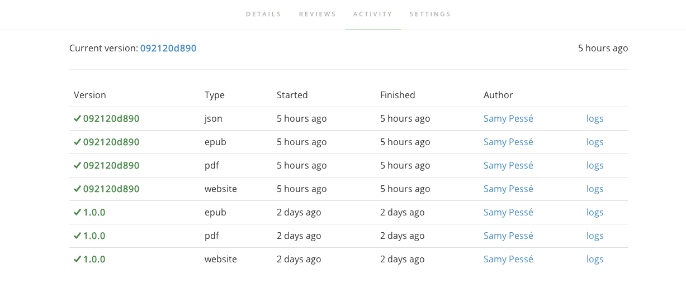
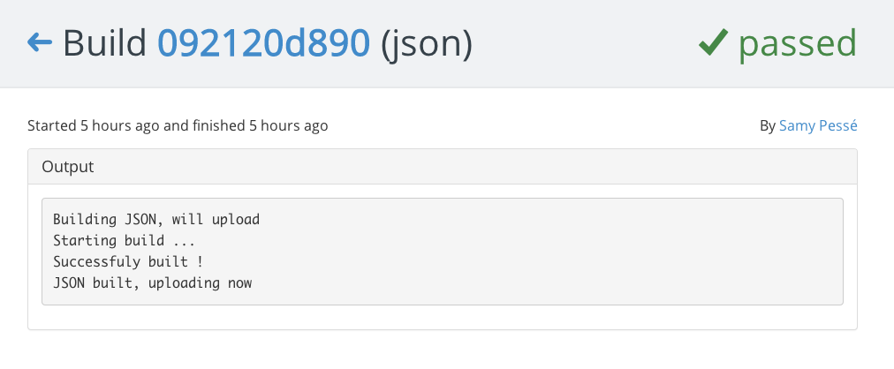

# Build

After you pushed content using **git** or the **editor**, GitBook.io will start different builds:

- **website**: it will generate the website
- **json**: il will extract metadata about the book (summary, introduction, ...)
- **epub**: it will generate the epub download
- **pdf**: it will generate the pdf download

### List builds

The **Activity** tab on your book let you follow the evolution of your builds.

### Details for a build

When clicking the link "logs" for a build, you can access a details page for it. This page will let you see the output of the build process.

### Fixing errors

If your build failed, you can use the logs to debug the issue and publish a fixed content.

[Read more about common build errors](./errors.md)
