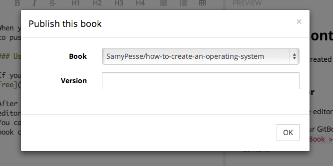

# Pushing Content

When your book is created on **gitbook.io**, you need to push some content to it.

### Using the Editor

If you don't have the editor yet, [install it for free](../editor/README.md).

After connecting your GitBook.io Account to the editor.
You can use the menu `Book > Publish` to update your book content.




### Using git

You can use Git to push update of your book.

```
$ git push https://push.gitbook.io/{{UserName}}/{{Book}}.git
```

It will prompt for your username (username or email) and your password (password or api token).

### What next?

Once you pushed content to GitBook.io, you need to check the state of your build.

[Read more](./build.md)
