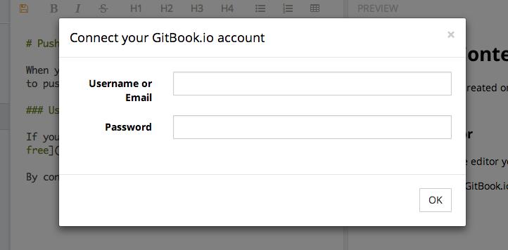

# Editor

### Download

The editor is available to [download](https://www.gitbook.io/editor/download) for these platforms:

* [Windows](https://www.gitbook.io/editor/download/win)
* [Mac OS](https://www.gitbook.io/editor/download/mac)
* [Linux 32bits](https://www.gitbook.io/editor/download/linux32)
* [Linux 64bits](https://www.gitbook.io/editor/download/linux64)

### Connect your GitBook.io account

You can connect easily your GitBook.io account by entering your username and password in the auth dialog:

