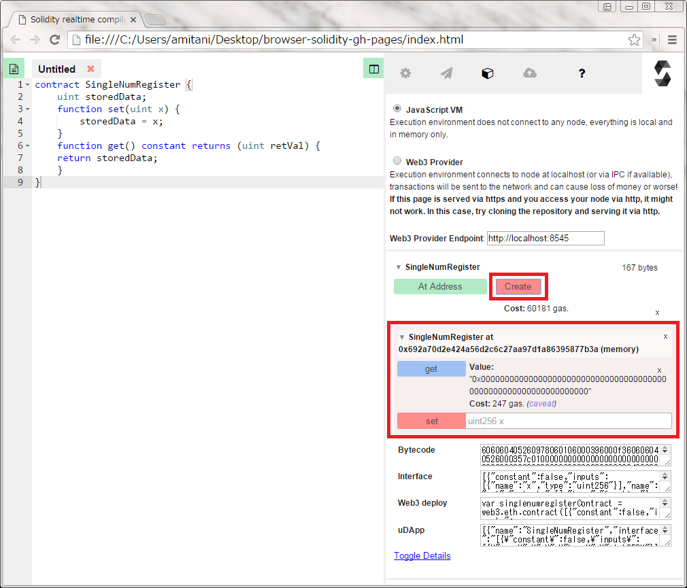

# Contract開発環境（IDE）の活用

前節までで、gethを用いてコマンドライン上でSolidity言語によるContractの作成からコンパイル、そして実行までを行う手順を見てきました。しかしこれらは見てきたように煩雑な操作が必要で、Solidity言語を用いてContractを実際に試行錯誤でコーディングしていくには不適です。そのため、Contractのコーディングとコンパイル及び実行を助ける幾つかの開発環境が開発され始めています。この節では、これらの中の一つの「[Remix-ide](https://github.com/ethereum/remix-ide)」（以下Remix-ide）の使い方を解説します。

[Remix-ide](https://github.com/ethereum/remix-ide)はSolidity言語の開発者の一人である[chriseth](https://github.com/chriseth)により開発されているSolidity言語用Contract開発環境（IDE）であり、Webブラウザ上で

* Contractのコーディング
* コンパイル
* 実行
    * ブロックチェーン上への登録
    * Contract上の関数の実行

が可能です。

## Remix-ideのダウンロードと起動
Remix-ideは以下のようにnpmを用いてインストールします。
remix-ideコマンドで起動したあとに、ブラウザで[ローカルホストの8080番ポート](http://127.0.0.1:8080)にアクセスすることで開くことができます。
```
$ npm install remix-ide -g
$ remix-ide
```

リポジトリから直接cloneする方法もあります。
```
$ git clone https://github.com/ethereum/remix-ide.git
$ cd remix-ide
$ npm install
$ npm run setupremix  
$ npm start
```

実際にRemix-ideをブラウザで開いた画面を下図に示します。画面は大きく左右２つに分かれています。左側はSolidity言語のコードエディタになっており、右側はそのContractの各種情報の表示や実行実行等を行う画面になっています。


Remix-ideは作成されたContractを２通りの方法方で実行することが可能です。これらの方法は、画面右の箱型のタブを押下して現れるラジオボタン「Java Script VM」と「Web3 Provider」で切り替えることが出来ます（下図）。

* **Java Script VM**： ブラウザ上での疑似実行モード。実際のEthereumノードには接続せず、ブラウザ上のJavascript VM 上でContractの関数を疑似的に実行します。
* **Web3 Provider**： Blockchain上での実行モード。実際のEthereumノードに接続し、作成したContractをブロックチェーン上に登録した上でContractの関数を実行します。

次の節から後者のWeb3 Providerのモードでの実行手順を見ていきます。


## Remix-ideとEthereumノードを接続する。
Remix-ideから作成したContractを実際のBlockchainに登録したりBlockchain上のContractを実行したりするためには、まずRemix-ideとEthereumノードを接続する必要があります。

### gethの起動
これまでのようにコマンドラインからgethを起動しテストネットに接続します[^2]。下記のコマンドを実行します。

```
$ geth --networkid "10" --nodiscover --datadir "/home/test_u/eth_private_net" --mine --unlock 0xa7653f153f9ead98dc3be08abfc5314f596f97c6 --rpc --rpcaddr "192.168.5.6" --rpcport "8545" --rpccorsdomain "*" console 2>> /home/test_u/eth_private_net/geth_err.log
```

ここで、幾つか新しいコマンドオプションが出てきました。Remix-ideとノードの接続には、gethのRPC（Remote Procedure Call）のAPI機能を利用するのでその設定をコマンドオプションで行っています。
* `--rpc`：gethのRPCサーバとしてのAPIを有効化します。
* `--rpcaddr "192.168.5.6"`:読者の環境に合わせてgethノードのIPアドレスを指定します。Remix-ideとgethを同じPC上で利用するなら "127.0.0.1"か"localhost"を指定します。
* `--rpcport "8545"`： RCP APIのポート番号を指定します。（特に問題なければデフォルトの8545を指定すればよいです。）
* `--rpccorsdomain "*"`： クロスドメインアクセスを許可するドメイン。ここでは任意のドメインを許可しています。

また、以下のオプションも加えています。
* `--mine`：gethの起動と同時に採掘を開始するオプション
* `--unlock 0xa7653f153f9ead98dc3be08abfc5314f596f97c6"`: 指定されたアドレスのアカウントのロックを解除します。読者の環境に合わせて、coinbaseのアドレスを指定してください。（起動時にパスワードが求められます。）

### Remix-ideからノードに接続
前述のようにRemix-ideをブラウザで開きます。下図のように、Contractを入力した後画面右側の箱形のアイコンのタブを選択し「Web3 Provider」のラジオボタンを選択します。また「Web3 Provider Endpoint」のテキストボックスにはgethの起動時に指定したrpcaddrとrpcportを組み合わせて「http://rpcaddr:rpcport 」の形式で指定します。（ここの例ではhttp://192.168.5.6:8545）

画面右下などに接続エラー等が表示されなければ、gethとのrpcでの接続が成功しています[^3]。


### Contractの作成・ブロックチェーンへの登録・実行
画面左側のエディタでContractを作成します。ここでは例として「Contractを作成する」節<!--[REF]-->で使用した「SingleNumRegister」Contractコードを左側のコード・エディタ部分に入力します（下図左）。コードを入力し終えたら右側の赤色のCreateボタンを押下します。Remix-ideは指定されたEthereumノードにアクセスしブロックチェーン上にContractを登録するためのTransactionを発行します。しばらくして（数秒～十数秒）Ethereumネットワーク上[^4]でTransactionが採掘されると今回のContractのブロックチェーン上でのアドレスとContractで規定された関数（ここではgetとsetの関数）が表示されます（下図右）。



実際にset関数のテキスト入力エリアに正の整数値、例えば「136」を入力し赤色のいるset関数実行ボタンを押下するとbrouser-solidityはトランザクションを発行しEthereumネットワーク上で採掘されるとトランザクション実行結果が表示されます。またそのあと青色のget関数ボタンを押下すればset関数で設定した正の整数が表示されることになります。

<!--
## Remix-ide そのほかの機能
(追記予定）
コントラクタの引数
AtAddress botann -->


#### 脚注
[^1]: コマンドは変わる可能性があるので[公式レポジトリ](https://github.com/ethereum/remix-ide)で確認することを推奨します。

[^2]: ライブ・ネットに接続することも可能ですが、実験的な作業はテスト・ネットで行うことを推奨します。

[^3]: <!-- [TODO] chromeの開発ツールでの確認方法を示す。-->

[^4]: 今回の例ではテストネットで単独ノードなので、厳密にはEthereumネットワーク上での採掘ではなく、指定したノード上での採掘になります。

---
[This work](http://book.ethereum-jp.net/) is licenced under a [Creative Commons Attribution-ShareAlike 4.0 International License](http://creativecommons.org/licenses/by-sa/4.0/).
