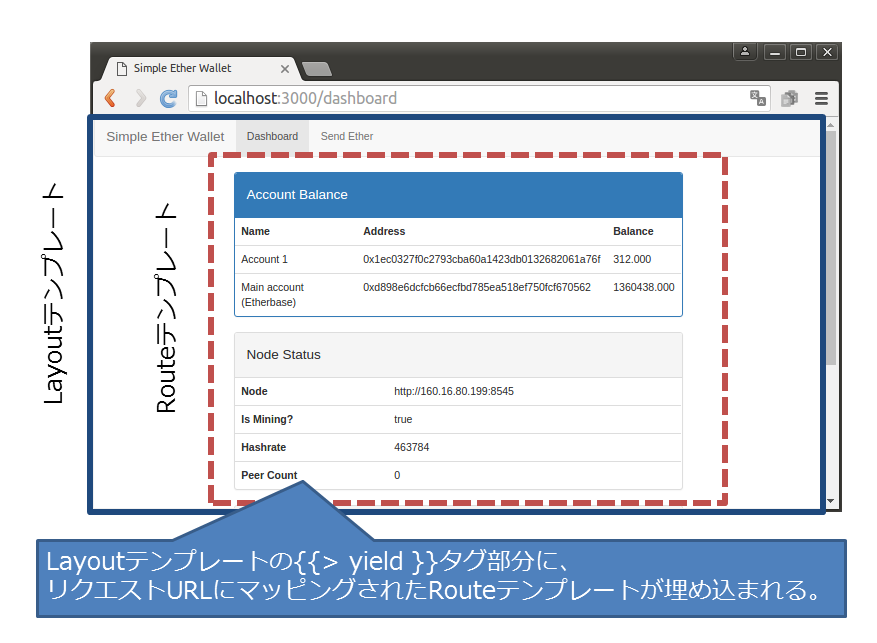
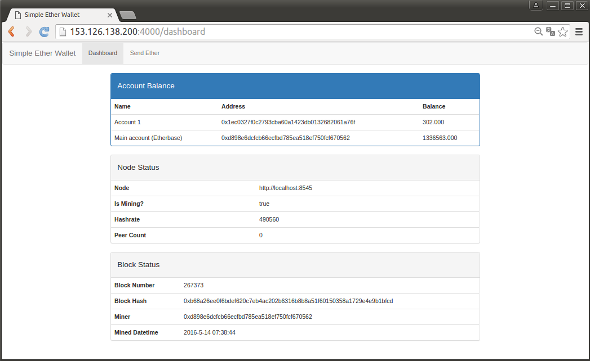
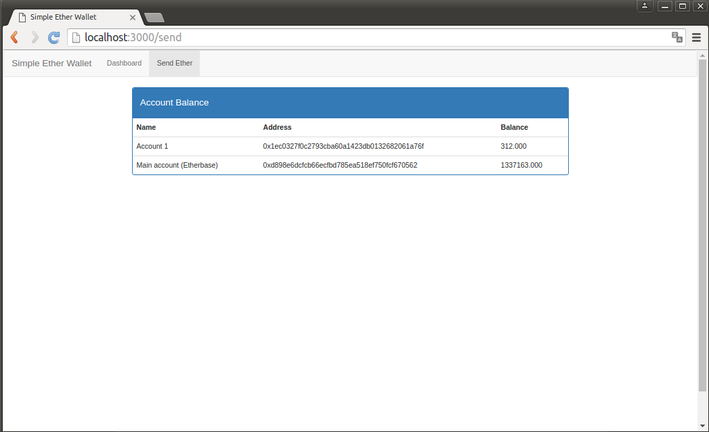
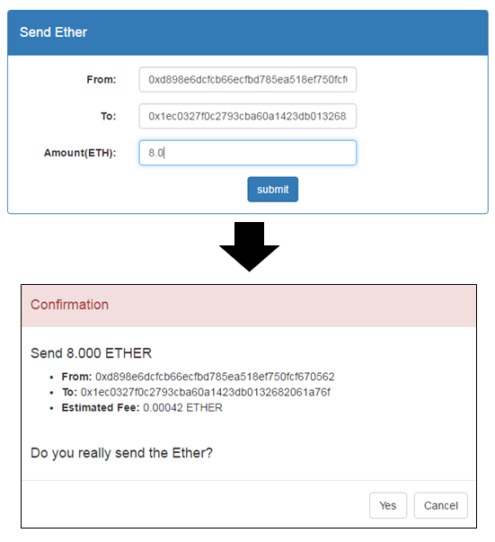

## 簡単なEtherのwalletを作る（２）

前節で「simple-ether-wallet」のダッシュボード部分の実装を行ってきました。本節では「Send」ビューを追加しアカウント間でのEtherの送金を可能にしていきます。

### URLルーティング
まず、DashboardとSendの２つのビューそれぞれにURLをマッピングし、リクエストされたURLに応じてどのビューを表示するかをコントロールするURLルーティングの仕組みを導入します。MeteorではURLルーティングに「iron:router」パッケージを利用するのが最も一般的のため、ここでもそれに倣います。コンソール上でプロジェクトRootに移動し下記のコマンドを実行することでパッケージがインストールされます。

```bash
$ meteor add iron:router
```
iron:routerを用いたURLルーティングは、Layoutテンプレートと呼ばれるサイト全体で共通のテンプレートの中にInclusionsタグの一種`{{> yield}}`を埋め込み、iron:routerが自動的にリクエストURLにマッピングされたテンプレート（Routeテンプレート）を`{{> yield}}`部分に埋め込み表示する動作をします。



#### URLルーティングの設定
Layoutテンプレートの指定やURLへのテンプレートのマッピングは`Router`オブジェクトの属性を設定することで行います。そこで下記のコードを記述した`route.js`を`client/lib`以下に作成します。ここでは以下の動作を記述しています。

* Layoutテンプレートとして`walletLayout`を指定。
* URLが'/'の場合は'/dashboard'にリダイレクトさせる。（例えば、http://localhost:3000 のリクエストが来た場合、http://localhost:3000/dashboard にリダイレクトさせる。）
* URLが'/dashboard'の場合はRouteテンプレートとして`dashboard`テンプレートを割り当てる。
*  URLが'/send'の場合はRouteテンプレートとして`send`テンプレートを割り当てる。


> client/lib/route.js


```javascript
Router.configure({
  //Layoutテンプレートの指定
  layoutTemplate: 'walletLayout'
});

Router.route('/', function () {
  //リダイレクト設定
  this.redirect('/dashboard');
});

//URLとRouteテンプレートのマッピングを指定
Router.route('/dashboard', {name: 'dashboard'});
Router.route('/send', {name: 'send'});
```


#### Layoutテンプレートの追加
Layoutテンプレートとして指定した`walletLayout`テンプレートとそのヘルパー関数を追加します。iron:routerはLayoutテンプレートを自動的にhtmlファイルの`<body>`タグ内に展開するように動作するため、この`walletLayout`テンプレートでは`<body>`タグの内部に記述されるべきコードのみを記述します。また元々`<body>`タグとその内部を記述していた`main.html`からは当該箇所を削除します。


> client/templates/wallet_layout.html


```html
<template name="walletLayout">
  <nav class="navbar navbar-default">
    <div class="container-fluid">
      <div class="navbar-header">
        <a class="navbar-brand" href="{{pathFor 'dashboard'}}">Simple Ether Wallet</a>
      </div>
      <ul class="nav navbar-nav">
        <li class="{{activeIfCurrent 'dashboard'}}"><a href="{{pathFor 'dashboard'}}">Dashboard</a></li>
        <li class="{{activeIfCurrent 'send'}}"><a href="{{pathFor 'send'}}">Send Ether</a></li>
      </ul>
    </div>
  </nav>
  <main class="container-fluid">
    {{> yield}}
  </main>
</template>
```

> client/templates/wallet_layout.js


```js
Template.walletLayout.helpers({
  //ナビゲーションバーのアイテムをハイライトするためのヘルパー関数
  activeIfCurrent: function (template) {
    var currentRoute = Router.current();
    if(currentRoute && template === Router.current().route.getName()){
      return 'active';
    }else{
      return '';
    }
  }
});
```

> client/main.html


```html
<head>
  <title>Simple Ether Wallet</title>
</head>
```

以上までの手順で、ナビゲーションバーとURLとテンプレートのマッピング機能が追加されました。次にURLにマッピングされた各ビューのテンプレートを追加していきます。

### DashboardとSendビューの追加
#### Dashboardビュー
Dashboardビュー用のテンプレートを追加していきます。Dashboardビューでは「簡単なEtherのWalletを作る（１）」の節で追加していったものと同じ
* Account Balance
* Node Status
* Block Status

の３つのコンポーネントで構成することにします。そのためDashbordビューのテンプレートとしてこれらのコンポーネントのテンプレートを呼び出すように下記のコードを追加することで、Dashboardビューの表示が可能になります。

> client/templates/views/dashboard.html

```html
<template name="dashboard">
  <div class="row-fluid">
    <div class="col-md-8 col-md-offset-2">
      {{> accountBalanceComponent}}
      {{> nodeStatusComponent}}
      {{> blockStatusComponent}}
    </div>
  </div>
</template>
```
dashboardビューはこれで完成です。

#### Sendビュー
次に、Sendビューのテンプレートとして下記のコードを追加します。以降の節でSendビューの機能を追加していきますが、ここではその土台として下記のように「Account Balance」のコンポーネントのみ追加しています。

> client/templates/views/send.html

```html
<template name="send">
  <div class="row-fluid">
    <div class="col-md-8 col-md-offset-2">
      {{> accountBalanceComponent}}
    </div>
  </div>
</template>
```

以上までで、以下のイメージのようにナビゲーションバーからそれぞれのビューに遷移が可能になります。


【Dashboardビューでの表示】


【Sendビューでの表示】


<div class="commit">
  
  <div class="message">
    <p><b><a href="https://github.com/a-mitani/simple-ether-wallet/releases/tag/step006" target="_blank">
      View this Commit On GitHub (Tag:"Step006")
    </a></b></p>
   </div>
</div>

### 送金機能の追加
SendビューにEtherを送金する機能を加えていきます。まずは「Send Ether」コンポーネントを追加します。下図のように送金元アドレスと送金先アドレス、および送金するEtherの額を入力し「Submit」ボタンを押下することで送金を確認するモーダルウィンドウが表示され、そこで「Yes」を押下するとEthereumのノードにトランザクションが送信される動きをします。



【Submitボタンを押下するとモーダルの確認画面が表示される】


#### 送金情報入力画面と確認画面の表示
まずは送金情報を入力する画面と送金の確認を行う画面までを作成していきます。また送金の確認画面では送金に必要なFeeの表示も行います。

Sendビューのテンプレートに既存の`accountBalanceComponent`のInclusionsタグの後に`sendEtherComponent`のInclusionsタグを追加します。

> client/templates/views/send.html

```html
（前略）
      {{> accountBalanceComponent}}
      {{> sendEtherComponent}}
（後略）
```

そして追加した`sendEtherComponent`テンプレートのコードを下記のように追加します。

> client/templates/components/send_ether_component.html

```html
<template name="sendEtherComponent">
  <div class="panel panel-primary">
    <div class="panel-heading">
      <h4>Send Ether</h4>
    </div>
    <div class="panel-body">
      <form class="form-horizontal">
        {{> sendInputTemplate inputId="f-addr" labelStr="From:" placeholderStr="0x1234abcdef...."}}
        {{> sendInputTemplate inputId="t-addr" labelStr="To:" placeholderStr="0x1234abcdef...."}}
        {{> sendInputTemplate inputId="amount" labelStr="Amount(ETH):" placeholderStr="0.0"}}
        <input type="submit" value="submit" class="btn btn-primary col-md-offset-6"/>
      </form>
    </div>
  </div>
  {{> sendConfirmModalTemplate}}
</template>

<template name="sendInputTemplate">
  <div class="form-group">
    <label class="control-label col-md-3" for="{{inputId}}">{{labelStr}}</label>
    <div class="controls col-md-6">
      <input name="{{inputId}}" id="{{iputId}}" type="text" value="" placeholder="{{placeholderStr}}" class="form-control"/>
    </div>
  </div>
</template>

<template name="sendConfirmModalTemplate">
  <div class="modal fade" id="sendConfirmModal">
    <div class="modal-dialog">
      <div class="modal-content">
        <div class="modal-header alert-danger">
          <h4 class="modal-title">Confirmation</h4>
        </div>
        <div class="modal-body">
          <h4>Send {{sendAmountInEther}} ETHER</h4>
          <ul>
            <li><b>From:</b> {{fAddr}}</li>
            <li><b>To:</b> {{tAddr}}</li>
            <li><b>Estimated Fee:</b> {{fee}} ETHER</li>
          </ul>
          <br/>
          <h4>Do you really send the Ether?</h4>
        </div>
        <div class="modal-footer">
          <button type="button" class="btn btn-default" id="send">Yes</button>
            <button type="button" class="btn btn-default" data-dismiss="modal">Cancel</button>
        </div>
      </div>
    </div>
  </div>
</template>
```

送金情報をSession変数で管理するために、初期化のコードを`initSessionVars`関数内に追記します。

> client/lib/modules/init_session_vars.js

```javascript
//Session変数の初期化
initSessionVars = function(){
(中略）
//送金関連の変数
var initialFundInfo = {
  amount:0,
  fAddr:0x0,
  tAddr:0x0,
};
Session.setDefault("sendEther.fundInfo", initialFundInfo);
Session.setDefault("sendEther.estimatedGas", 0);
Session.setDefault("sendEther.currentGasPrice", 0);

};
```

送金入力画面及び確認画面のヘルパと送金入力画面のイベント処理のコードを追加します。送金入力画面

> client/templates/components/send_ether_component.js

```javascript
//送金に必要なFeeの計算。
//必要なFee ＝ 必要Gas × Gasプライス
var estimatedFeeInWei =  function(){
  var gas = Session.get('sendEther.estimatedGas');
  var gasPrice = new BigNumber(Session.get('sendEther.currentGasPrice'));
  return gasPrice.mul(gas);
}

var estimationCallback = function(e, res){
    var template = this;
    console.log('Estimated gas: ', res, e);
    if(!e && res) {
        Session.set('sendEther.estimatedGas', res);
    }
};

var getGasPriceCallback = function(e, res){
    var template = this;
    console.log('Current Gas Price in Wei: ', res.toString(10), e);
    if(!e && res) {
        Session.set('sendEther.currentGasPrice', res.toString(10));
    }
};

Template.sendEtherComponent.events({
  //「Send Ether」コンポーネントのSubmitボタン押下時のイベント制御
  'submit form': function(e) {
    var template = this;
    e.preventDefault(); //ボタン押下時のブラウザでのデフォルト動作の禁止

    //画面で入力された送金情報を「fundInfo」オブジェクトに格納
    var fundInfo = {
      fAddr: $(e.target).find('[name=f-addr]').val(),
      tAddr: $(e.target).find('[name=t-addr]').val(),
      amount: web3.toWei($(e.target).find('[name=amount]').val(),'ether')
    };

    if(EthAccounts.findOne({address: fundInfo.fAddr}, {reactive: false})) {
      //送金情報をSession変数に格納
      Session.set('sendEther.fundInfo', fundInfo);

      //必要Gas量の見積もりをEthereumノードに問い合わせ→ Session変数に格納
      web3.eth.estimateGas({from: fundInfo.fAddr, to: fundInfo.tAddr, value: fundInfo.amount}, estimationCallback.bind(template));

      //現在のGas priceをEthereumノードに問い合わせ問い合わせ→ Session変数に格納
      web3.eth.getGasPrice(getGasPriceCallback.bind(template));

      //送金確認画面（モーダルウィンドウ）の表示
      $('#sendConfirmModal').modal('show');
    }
  }
});

//送金確認画面のヘルパー
Template.sendConfirmModalTemplate.helpers({
  sendAmountInEther: function(){
    var amountEth = web3.fromWei(Session.get("sendEther.fundInfo").amount,'ether');
    return parseFloat(amountEth).toFixed(3);
  },
  fAddr: function(){
    return Session.get("sendEther.fundInfo").fAddr;
  },
  tAddr: function(){
    return Session.get("sendEther.fundInfo").tAddr;
  },
  fee: function(){
    return web3.fromWei(estimatedFeeInWei(),'ether').toString(10);
  }
});
```


### トランザクションの送信
ここまでで、

* 送金情報の入力
* 必要なFeeの計算
* 確認画面の表示

といったEtherの送金の準備に必要な機能が追加されました。次に確認画面で「Yes」ボタンを押下することで、入力内容に沿った送金を行うトランザクションがEthereumネットワーク上に送信する機能を追加します。

この機能は


###脚注
[^1] gethが起動しているサーバと同じ環境でも構いませんし、別サーバでも構いません。ここではgethが起動しているサーバと同じサーバ上で作っていく前提で解説していきます。

[^2] Chromeブラウザの開発者ツールは「F12」キー、または「Ctrl+Shift＋I」キーで起動できます。またConsoleは開発者ツール内のConsoleタブを押下すれば表示されます。

