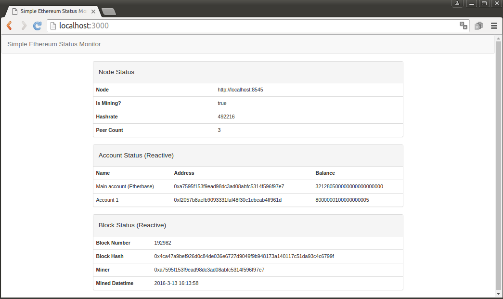
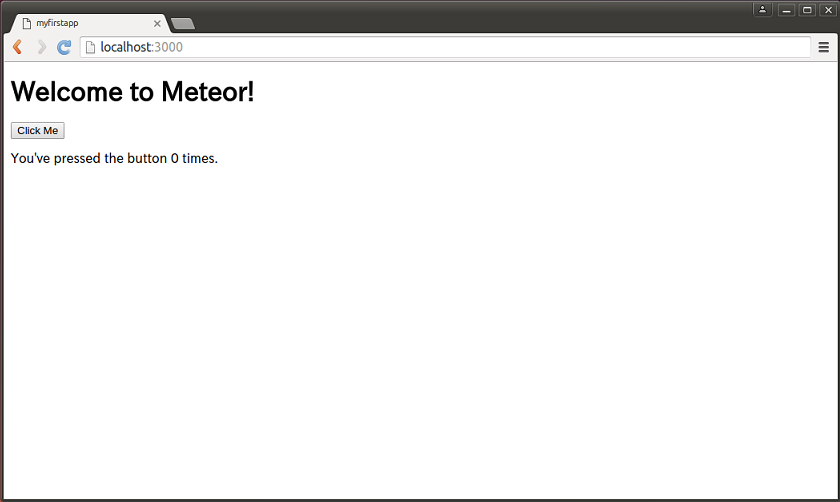
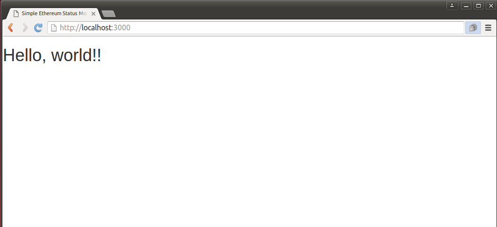
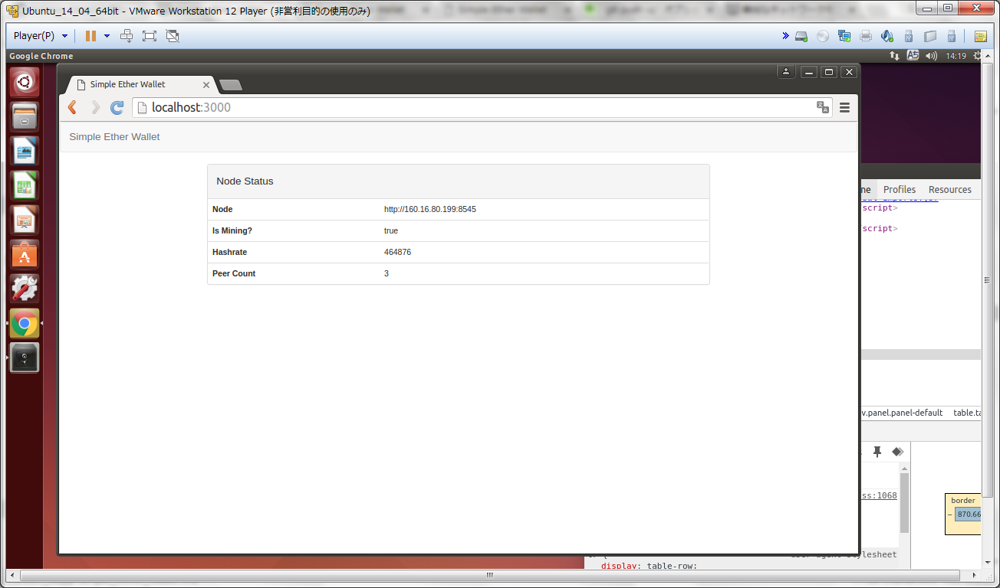

## 単純なネットワークモニターを作ってみる

### simple-eth-monitor
MeteorによるDapp開発の第一歩として、Ethereumのノードに接続しEthereumのネットワークの状態をモニターする単純なアプリケーション「simple-eth-monitor」を作るところから始めましょう。本節で説明するアプリケーションのソースコードは[GitHub上](https://github.com/a-mitani/simple-eth-monitor)に公開しています。

今回作成するsimple-eth-monitorはブラウザ上から特定のEthereumノードに接続し、下図の画面のような情報を表示する単純なモニターの役割を果たすものです。また「Account Status」と「Block Status」の項目については、ユーザーがブラウザ上で再読み込み等の特別な操作をすることなくEthereumネットワーク上での最新の情報が自動的に更新されていくリアクティブな動きをします。



### gethの起動（RPCの有効化）
まず下準備として、simple-eth-monitorからの接続を受けるように下記のコマンドでgethを起動しておきます。ここではネットワークIDが10のテストネットに接続しています。本格的にDappを公開するまではテストネットにて動作を確認するほうが良いでしょう。

``` bash
$ geth --networkid "10" --datadir "/home/test_u/eth_data" --logfile "/home/test_u/eth_data/geth_01.log" --mine --unlock 0xa7653f153f9ead98dc3be08abfc5314f596f97c6 --rpc --rpcaddr "192.168.5.6" --rpcport "8545" --rpccorsdomain "*" --olympic console 2>> /home/test_u/eth_testnet_1201/geth_e01.log
```

上記コマンドは幾つか新しいコマンドオプションを追加しています。今回作成するDappとノードの連携はGethのRPC（Remote Procedure Call）のAPI機能を利用するのでその設定をコマンドオプションで行っています。
* `--rpc`：gethのRPCサーバとしてのAPIを有効化します。
* `--rpcaddr "192.168.5.6"`:読者の環境に合わせてgethノードのIPアドレスを指定します。browser solidityとgethを同じPC上で利用するなら "127.0.0.1"か"localhost"を指定します。
* `--rpcport "8545"`： RCP APIのポート番号を指定します。（特に問題なければデフォルトの8545を指定すればよいです。）
* `--rpccorsdomain "*"`： クロスドメインアクセスを許可するドメイン。ここでは任意のドメインを許可しています。

また、以下のオプションも加えています。
* `--mine`：gethの起動と同時に採掘を開始するオプション
* `--unlock 0xa7653f153f9ead98dc3be08abfc5314f596f97c6"`: 指定されたアドレスのアカウントのロックを解除します。読者の環境に合わせて、coinbaseのアドレスを指定してください。（起動時にパスワードが求められます。）

###### ■■ TIP ■■
gethのconsoleを利用せずバックグラウンドでgethを起動しておくと便利です。その場合は
1. 上記コマンドの`console`のオプションを外して実行
2. プロンプト上でパスワードを聞かれたら、入力。
3. ［Ctrl］＋［Z］キーを押下しプロセスを一時停止
4. `bg`コマンドを実行し、プロセスをバックグラウンド実行に移行

の手順で行えばよいでしょう。

### Meteorプロジェクト作成と整備
Meteorをインストールした環境[^1]で適当なディレクトリに、今回作成するsimple-eth-monitorのMeteorプロジェクトを作成します。
``` bash
$ cd ~/eth-meteor-proj # 任意のディレクトリに移動
$ meteor create simple-eth-monitor # 新しいMeteorプロジェクトを作成
```
「Meteorを使ってみる」節と同様に、この初期状態のWebアプリで念のためアクセス可能かを確認してみます。上記コマンドを実行して新しく作成された`simple-eth-monitor`ディレクトリ（以下、プロジェクトROOT）に移動して
``` bash
$ meteor
```
コマンドを実行します。実行するとしばらくしてコンソールに`=> App running at: http://localhost:3000/`と表示されるのでWebブラウザでアドレスに「http://localhost:3000/ 」と入力しアクセスします。すると下図のような（単純な）Webアプリケーションが表示されます。



起動して画面が表示されることが確認できたら、次にプロジェクトROOT以下の構成を整備します。

まず、プロジェクトROOT直下の`main.html`、`main.js`、`main.css`を削除します。また、新しく`client`ディレクトリを作成し、そのディレクトリ下に`main.html`、`main.js`ファイルを作成します。ここで`main.html`ファイルには下記のコードを記述、`main.js`は空のままにしておきます。


> main.js

``` html
<head>
  <title>Simple Ethereum Status Monitor</title>
</head>
<body>
  <h1> Hello, world!!</h1>
</body>
```
>**Tag**  Commit step001 ⇒ [View on GitHub](https://github.com/a-mitani/simple-eth-monitor/releases/tag/step001)

この状態でWebアプリケーションにアクセスすると、下図のような画面が表示されるはずです。



> **Note** 
> Meteorにはプロジェクト内のディレクトリ名には下記のルールがあります。
> * `server` ディレクトリ以下のファイルは、サーバサイドのみで実行されます。
> * `client` ディレクトリ以下のファイルはクライアントサイド（ex.ブラウザ上）のみで実行されます。
> * プロジェクト直下のファイル、および、上記以外のディレクトリ以下のファイルはサーバサイドとクライアントサイドの両方で実行されます。
>
>  また、静的なコンテンツ、例えば画像データやフォントデータ等は`public`ディレクトリに配置されるのが慣習です。

### Ethereumノードへの接続
####パッケージの追加
Meteorには標準の機能以外の拡張機能をパッケージとしてインストールすることで様々な機能が追加可能です。Ethereumへの接続も、拡張機能としてパッケージを導入することで容易に可能になります。ここでは今後使用する以下の４つのパッケージを追加します。
* **twbs:bootstrap**: CSSフレームワーク「bootstrap」のパッケージ。
* **ethereum:web3**：EthreumノードとRPC接続するためのライブラリが含まれるパッケージ。
* **ethereum:accounts**：ethereum:web3パッケージのラッパーパッケージで、Ethereumのアカウント関連の情報をmeteor上でリアクティブに取得可能にするパッケージ。
* **ethereum:blocks**：ethereum:web3パッケージのラッパーパッケージで、Ethereumのブロックチェーン関連の情報をmeteor上でリアクティブに取得可能にするパッケージ。

プロジェクトROOTに移動し下記のコマンドを実行します。

``` bash
$ meteor add twbs:bootstrap 
$ meteor add ethereum:web3
$ meteor add ethereum:accounts
$ meteor add ethereum:blocks
```
> **Note** 
> プロジェクトに追加されたパッケージは
> `.meteor`ディレクトリ以下の`packages`ファイルに自動的に記載されます。実際に今回追加した4つのパッケージが`packages`ファイルの末尾に追記されているのを確認してみてください。

####Ethereumノードへの接続
今回追加したパッケージを利用しEthereumノードに接続します。
`client`ディレクトリ以下に`lib`ディレクトリを作成しその下に以下のコードを記述した`init.js`ファイルを配置します。

> client/lib/init.js

``` javascript
//Web3インスタンスの生成
web3 = new Web3();

//RPCプロバイダを設定
//URLの部分は読者の環境に合わせてください。（localhostの部分はIPアドレスにて指定してもかまいません。）
if(!web3.currentProvider)
  web3.setProvider(new web3.providers.HttpProvider("http://localhost:8545"));

// EthAccounts初期化
EthAccounts.init();

//EthBlocksの初期化
EthBlocks.init();
```
この状態でWebアプリケーションを起動してアクセスしてみます。表示される画面は変わらず「Hello, world!!」が表示されますが、アクセス時にブラウザには`init.js`もロードされ処理が実行されているためブラウザ上からEthereumノードにRPCでアクセスが可能になっています。Chromeの開発者ツールのConsoleを起動[^2] し、Ethereumノードに対してアカウントリストを問い合わせる

```javascript
> web3.eth.accounts;
```
のコマンドを実行してみます。
実行結果として
```javascript
["0xa7595f153f9ead98dc3ad08abfc5314f596f97e7", "0xf2057b8aefb9093331faf48f30c1ebeab4ff961d"]
```
のようなアカウントの配列が返されれば、ブラウザからEthereumノードへのアクセスが成功しています。もしこのような結果が返らない場合はgethの起動とそのオプション、アドレスなどを再度確認してください。

>**Tag**  Commit step002 ⇒ [View on GitHub](https://github.com/a-mitani/simple-eth-monitor/releases/tag/step002)


> **Note** 
> `init.js`ファイルを`client/lib`以下に配置したのは、初期化の処理を今後追加されていくその他の処理よりも先に処理したい理由からです。MeteorではプロジェクトRoot以下のファイルをロードする順序として、`lib`という名称のディレクトリ以下のファイルを最初に読み込むというルールがあるため、今回の`init.js`は例えば`main.html`や`main.js`よりも先にMeteorによりロードされる事になります。Meteorがファイルをロードする順序は[公式ドキュメント（英語）の「File Load Order」節](http://docs.meteor.com/#/full/fileloadorder)に詳細が記載されているので参考にしてください。

###コンポーネントを追加する
#### 「Node Status」項目の表示
これまでの作業でブラウザからEthereumノードへの接続が可能になりました。これを利用して画面に「Node Status」項目を表示するようにしていきます。

まずは、`client/main.html`と`client/main.js`ファイルを下記のコードに書き換えます。

> client/main.html

```html
<head>
  <title>Simple Ethereum Statud Explorer</title>
</head>

<body>
  <nav class="navbar navbar-default">
    <div class="container-fluid">
      <div class="navbar-header">
        <a class="navbar-brand" href="/">Simple Ethereum Status Explorer</a>
      </div>
    </div>
  </nav>

  <main class="container-fluid">
    <div class="row-fluid">
      <div class="col-md-8 col-md-offset-2">
        {{> nodeStatusComponent}}
      </div>
    </div>
  </main>
</body>

<template name="nodeStatusComponent">
  <div class="panel panel-default">
    <div class="panel-heading">
      <h4>Node Status</h4>
    </div>
    <table class="table">
      <tbody>
          <tr>
            <th scope="row">Node</th>
            <td>{{currentProvider}}</td>
          </tr>
          <tr>
            <th scope="row">Is Mining?</th>
            <td>{{isMining}}</td>
          </tr>
          <tr>
            <th scope="row">Hashrate</th>
            <td>{{currentHashrate}}</td>
          </tr>
          <tr>
            <th scope="row">Peer Count</th>
            <td>{{currentPeerCount}}</td>
          </tr>
      </tbody>
    </table>
  </div>
</template>
```

> client/main.js

```javascript
//テンプレート「nodeStatusComponent」のテンプレートヘルパー
//web3オブジェクトのプロパティを取得する各種メソッドを定義。
Template.nodeStatusComponent.helpers({

  //接続先ノードの取得
  currentProvider: function(){
    return web3.currentProvider.host;
  },

  //接続先ノードのマイニング状態の取得
  //マイニング中であればtrue、そうでなければfalse
  isMining: function(){
    return web3.eth.mining;
  },

  //接続先ノードのマイニングのハッシュレートを取得
  currentHashrate: function(){
    return web3.eth.hashrate;
  },

  //接続先ノードのピア数の取得
  currentPeerCount: function(){
    return web3.net.peerCount;
  }
});
```
これらのコードを追加することで下図のような、Ethereumノードの状態のテーブルが表示されるはずです。



ここでは大きく２つ、「テンプレート」と「テンプレートヘルパー」を用いてEthereumノードの状態の取得から表示までを行いました。少しこれらのコードを詳しく見ていきます。

#####■ テンプレートエンジン：Spacebar
`client/main.html`はおおよそ通常のHTMLファイルの構造と同様ですが、幾つかの部分でMeteor独特の記述が現れています。これはMeteorがテンプレートエンジンとして独自の「[Spacebar](https://github.com/meteor/meteor/blob/devel/packages/spacebars/README.md)」を採用しており、その構文が含まれていることによります。

Spacebarには主に3種類のタグが規定されています。

1つめはInclusionsタグと呼ばれるもので、`{{> xxx }}`の構文で用います。このタグが配置された場所に、`xxx`の部分で指定された名前と同じname属性を持つ`<template>`タグの内容を挿入する働きをします。今回の`client/main.html`の例では`{{> nodeStatusComponent}}`が、`<template name="nodeStatusComponent">`と`</template>`に囲まれた部分の内容に置き換わることになります。

2つめは「Expressionsタグ」と呼ばれるもので`{{xxx}}`の構文で用います。現在のオブジェクトの属性値か、またはすぐ後に後述するテンプレートヘルパーの関数の戻り値に置き換わる働きをします。今回の `client/main.html` の例では`{{isMining}}`は `client/main.js` の`isMining`関数の返り値に置き換わることになります。

最後は「block helpersタグ」と呼ばれるもので`{{#each}}…{{/each}}` や `{{#if}}…{{/if}}`のような構文で用いられるタグで、テンプレート内での処理フローを制御する働きをします。本節では使用せず詳細は次節以降に譲ります。


##### ■ テンプレートヘルパー
`client/main.js`にはテンプレートヘルパーが定義されています。Meteorでは表示とロジックを分離する設計がされており、表示はテンプレートが、そして表示のためのデータの取得や加工などのロジックはテンプレートヘルパーがその役割を担います。

テンプレートヘルパーは`Template.<myTemplate>.helpers(helperObject)`の形式で定義し、ここで`<myTemplate>`の部分にヘルパーが対象とするテンプレート名に置きかえます。また`helerObject`はヘルパー関数が連想配列形式で列挙されたオブジェクトになります。

今回の`client/main.js`の例では対象とするテンプレート名から`Template.nodeStatusComponent.helpers(...)`として定義され引数として、`web3`オブジェクトからノード状態のプロパティを返するため幾つかの関数が定義されています。

>**Tag**  Commit step003 ⇒ [View on GitHub](https://github.com/a-mitani/simple-eth-monitor/releases/tag/step003)

#### ソースファイルの分離
この後、アカウント情報とブロック情報を表示する2つのコンポーネント（accountStatusComponentとblockStatusComponent）を追加していきます。これらも先のnodeStatusComponentと同様にテンプレートとそのヘルパーをそれぞれ`main.html`、`main.js`に追記しても問題ありませが、ここではコンポーネント毎にソースファイルを分けて管理することで見通しを良くします。

たとえソースファイルを分けても、Meteorは自動的にclientディレクトリ以下のファイルをロードの順序の規則に則って読み込み、それらを連結して1つのソースファイルと同様に扱うため、動作には影響ありません。

慣習的にテンプレート関連のファイルは`client/templates`ディレクトリ以下に配置され、テンプレート名が`templateName`の場合、`template_name.html`と`template_name.js`ファイルとしてそれぞれ配置されます。この慣習に倣ってそれぞれ`main.html`と`main.js`に記述したコードを一部取り出して、以下のファイルを作成します。また`main.html`と`main.js`の当該コード箇所は削除します。

> client/templates/node_status_component.html

```html
<template name="nodeStatusComponent">
  <div class="panel panel-default">
    <div class="panel-heading">
      <h4>Node Status</h4>
    </div>
    <table class="table">
      <tbody>
          <tr>
            <th scope="row">Node</th>
            <td>{{currentProvider}}</td>
          </tr>
          <tr>
            <th scope="row">Is Mining?</th>
            <td>{{isMining}}</td>
          </tr>
          <tr>
            <th scope="row">Hashrate</th>
            <td>{{currentHashrate}}</td>
          </tr>
          <tr>
            <th scope="row">Peer Count</th>
            <td>{{currentPeerCount}}</td>
          </tr>
      </tbody>
    </table>
  </div>
</template>
```

> client/templates/node_status_component.js

```javascript
//テンプレート「nodeStatusComponent」のテンプレートヘルパー
//web3オブジェクトのプロパティを取得する各種メソッドを定義。
Template.nodeStatusComponent.helpers({

  //接続先ノードの取得
  currentProvider: function(){
    return web3.currentProvider.host;
  },

  //接続先ノードのマイニング状態の取得
  //マイニング中であればtrue、そうでなければfalse
  isMining: function(){
    return web3.eth.mining;
  },

  //接続先ノードのマイニングのハッシュレートを取得
  currentHashrate: function(){
    return web3.eth.hashrate;
  },

  //接続先ノードのピア数の取得
  currentPeerCount: function(){
    return web3.net.peerCount;
  }
});

```
>**Tag**  Commit step004 ⇒ [View on GitHub](https://github.com/a-mitani/simple-eth-monitor/releases/tag/step004)

#### 「Account Status」「Block Status」項目の表示
次に、ノードに登録されているアカウント情報を表示する「Account Status」とEthereumネットワーク内のブロックチェーンの情報を表示する「Block Status」の２つのコンポーネントを追加します。

まず`client/main.html`にこれらのコンポーネントのテンプレートを呼び出し表示するためのInclusionsタグ`{{> accountStatusComponent}}`、`{{> accountStatusComponent}}`を追加します。

> client/main.html （一部抜粋）

```html
（前略）
  <main class="container-fluid">
    <div class="row-fluid">
      <div class="col-md-8 col-md-offset-2">
        {{> nodeStatusComponent}}
        {{> accountStatusComponent}}
      </div>
    </div>
  </main>
（後略）
```

さらにテンプレートとテンプレートヘルパーも追加します。ここでテンプレートのidは今回追加したInclusionタグと同じものにします。

> client/templates/account_status_component.html

``` html
<template name="accountStatusComponent">
  <div class="panel panel-default">
    <div class="panel-heading">
      <h4>Account Status (Reactive)</h4>
    </div>
    <table class="table">
      <thead>
        <tr>
          <th>Name</th>
          <th>Address</th>
          <th>Balance</th>
        </tr>
      </thead>
      <tbody>
        {{#each accounts}}
          <tr>
            <td>{{name}}</td>
            <td>{{address}}</td>
            <td>{{balance}}</td>
          </tr>
        {{/each}}
      </tbody>
    </table>
  </div>
</template>
```

> client/templates/account_status_component.js

``` javascript
//テンプレート「accountStatusComponent」のヘルパー
Template.accountStatusComponent.helpers({
  //アカウント情報の取得
  accounts: function(){
    return EthAccounts.find({});
  }
});
```

> client/templates/block_status_component.html

``` html
<template name="blockStatusComponent">
  <div class="panel panel-default">
    <div class="panel-heading">
      <h4>Block Status (Reactive)</h4>
    </div>
    <table class="table">
      <tbody>
          <tr>
            <th scope="row">Block Number</th>
            <td>{{latestBlockNum}}</td>
          </tr>
          <tr>
            <th scope="row">Block Hash</th>
            <td>{{latestBlockHash}}</td>
          </tr>
          <tr>
            <th scope="row">Miner</th>
            <td>{{latestBlockMiner}}</td>
          </tr>
          <tr>
            <th scope="row">Mined Datetime</th>
            <td>{{latestBlockDatetime}}</td>
          </tr>
      </tbody>
    </table>
  </div>
</template>
```

> client/templates/block_status_component.js

``` javascript
//テンプレート「blockStatusComponent」のヘルパー
Template.blockStatusComponent.helpers({

  //最新のブロック番号の取得
  latestBlockNum: function(){
    return EthBlocks.latest.number;
  },

  //最新ブロックのハッシュ値を取得
  latestBlockHash: function(){
    return EthBlocks.latest.hash;
  },

  //最新ブロックを採掘した採掘者のアドレスを取得
  latestBlockMiner: function(){
    return EthBlocks.latest.miner;
  },

  //最新ブロックの採掘日時を取得
  latestBlockDatetime: function(){
    return unix2datetime(EthBlocks.latest.timestamp);
  }
});
```

ここで、それぞれのヘルパーは、`nodeStatusComponent`のヘルパとは異なり、情報をweb3オブジェクトから取得するのではなく、そのラッパーである`EthAccounts`や`EthBlocks`から取り出しています。これらのラッパー・オブジェクトを利用することで、状態が変わると自動的に表示が更新されるリアクティブな表示が可能になります。

また、`lient/templates/account_status_component.html`内で`{{#each accounts}}...{{/each}}`のblock helpersタグが追加されています。これはヘルパーでのaccountsメソッドで取得されるのはアカウントオブジェクトの配列であり、その配列の要素づつ取り出し、それぞれのオブジェクトで`name`や`balance`属性を取得するようにしています。

最後に、`blockStatusComponent`のヘルパ内で、UNIX時間表記で得られる採掘日時を通常の日時表記で表示されるよう`unix2datetime`関数を呼び出しているので、この関数のコードを追加します。

> client/lib/unix2datetime.js

```javascript
//UNIX時間を通常の "yyyymmdd hh:mm:ss"フォーマットの文字列に変換
unix2datetime = function (unixtime){
  var date = new Date( unixtime * 1000 );
  var year  = date.getFullYear();
  var month = date.getMonth() + 1;
  var day   = date.getDate();
  var hour  = ( date.getHours()   < 10 ) ? '0' + date.getHours()   : date.getHours();
  var min   = ( date.getMinutes() < 10 ) ? '0' + date.getMinutes() : date.getMinutes();
  var sec   = ( date.getSeconds() < 10 ) ? '0' + date.getSeconds() : date.getSeconds();
  var datetimeString = year + '-' + month + '-' + day + ' ' + hour + ':' + min + ':' + sec ;
  return datetimeString;
};
```

これらが正しく記述されたら、下図のような画面が表示されます。ここで、今回追加した「」「」の項目はリアクティブな表示になっていることを実際に確かめてみてください。採掘が成功するたびにEtherebaseのbalance値やブロック情報の項目が、特に手動でリロードをすることなく自動的に更新されるのが見て取れるはずです。また、ノードに新しいアカウントを作成した際も自動的にアカウント情報が追加更新されることになります。


>**Tag**  Commit step005 ⇒ [View on GitHub](https://github.com/a-mitani/simple-eth-monitor/releases/tag/step005)

###脚注
[^1] gethが起動しているサーバと同じ環境でも構いませんし、別サーバでも構いません。ここではgethが起動しているサーバと同じサーバ上で作っていく前提で解説していきます。

[^2] Chromeブラウザの開発者ツールは「F12」キー、または「Ctrl+Shift＋I」キーで起動できます。またConsoleは開発者ツール内のConsoleタブを押下すれば表示されます。

