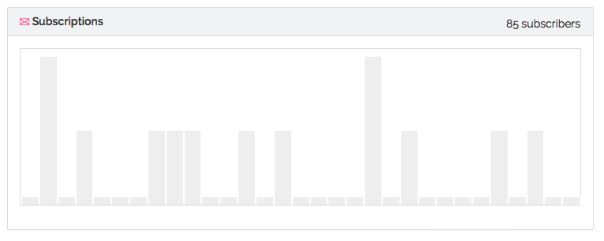

# Mailing

GitBook integrates an easy messaging and newsletter feature to help author communicate efficiently with readers.

### Newsletter

Readers and visitors can subscribe to a mailing list to get notifications about content updates (and even custom messages from authors).

The newsletter form can be integrated easily into a book homepage (already present in the default homepage theme).

### Mailing Dashboard

From your book dashboard, you can access the mailing dashboard, this page let you see stats about your newsletter subscribers and create messages.

### Create a new message

There is two types of messages: **Notifications** and **Newsletter messages**.

When creating a new message from your mailing dashboard, you can choose the type of message.

#### Newsletter message

Email notifications to subscribers will not sent immediately. All messages are sent at once, periodically (midnight PST).
The message is sent to all subscriber to the book newsletter.

#### Notification / Message to new buyer

You can only create one message of this type by book. It will be sent to every new reader of your **paid book**.

This message can be used to send a thank you note and start a mail discussion with the reader.

