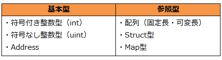

## 変数とデータ型

### 変数の宣言
Solidityは静的型付け言語であり、変数を定義する際にそこに格納するデータ型を明示する必要があります。
以下に符号付整数である`int`型の変数`x`を宣言する例を示します。
```plain
int x;
```
また次のように宣言時に初期値を指定する事も可能です。
```plain
int x = 10;
```
ちなみに初期値を設定しない場合には、各型のデフォルト値が格納されます。例えば`int`の場合、`0`が格納されます。
<!--[TODO] 識別子の説明上記では「x」が識別子 -->
<!--[TODO] 識別子の命名規則 -->

### データ型
##### 基本型と参照型
先に記したとおり、Solidityは静的型付け言語であり、変数を扱う際にはその変数のデータ型を強く意識する必要があります。Solidityには様々なデータ型が規定されていますが、それらは大きく基本型[^1] と参照型という２つのタイプに分類されます。

これらは変数に格納される際の方法に違いがあります。まず基本型の変数には、「値そのもの」が格納されます。一方で参照型の変数には「値を格納しているメモリ上のアドレス（参照）」が格納されます。この動作の違いにより基本型と参照型で変数を扱う際の挙動に違いが生まれます。基本形であるuint型の変数と、参照型である配列の変数を例にして、両者で代入の挙動の挙動に違いをみてみましょう。

``` plain
contract VarTypeTest {
  function valType() constant returns (uint retVal){ 
    uint a; 
    a = 10; 
    uint b = a; // (1)
    b = 20;  // (2)
    return a; // Execution result shows 10 !
  }
  
  function refType() constant returns (uint[2] retVal){
    uint[2] x;
    x[0] = 100;
    x[1] = 200;
    uint[2] y = x; //(3)
    y[0] = 500; // (4)
    y[1] = 600; // (4)
    return x; // Execution result shows [500, 600] !
  }
}
```

関数`valType()`では基本型であるuintの変数を代入した場合の挙動を試験しています。(1)の行では、変数`a`に代入された「10」という値そのものがコピーされて変数`b`に代入されます（**値渡し**）。その結果`b`の値が(2)で変更されても、元の変数`a`の内容には影響を与えません。その結果この関数の実行結果は`10`が示されます。

一方で関数`refType()`では参照型である配列の変数を代入した場合の挙動を試験しています。配列の変数は参照型であり、参照型の変数には「値を格納しているメモリ上のアドレス（参照）」が格納されています。そのため(3)で配列`x`を`y`に代入していますが、ここで実際に行われていることは、変数`x`の値を格納しているメモリ上のアドレスを変数`y`にセットしていることになります（**参照渡し**）。そのためこの時点で`x`と`y`は同じ場所を見ていることになり、(4)で`y`の内容を変えると同時に変数`x`の内容も変更されることになります。結果、この関数の実行結果は`[500, 600]`が示されます。

以下の表はSolidityで規定されているデータ型の分類です。


以下でSolidityで規定されている基本型と参照型のそれぞれのデータ型について見ていきます。

####符号付き整数型
以下の例のように符号付き整数型は`int●`句を用いて宣言します。ここで「●」は変数のビット長の指定であり8~256までの8の倍数が指定されます。例えばint8は8ビット符号付整数型を表わします（-128 ～ 127）。数字が省略され`int`と指定された場合は`int256`を意味します。またデフォルト値は0です。
```plain
int16 a = -10;  // 16 bitの符号付き整数型を宣言し「-10」を格納。
int b = 100;    // 256 bitの符号付整数型を宣言し「100」を格納。
int c;  //代入を行わないとデフォルト値「0」が格納される。
```

####符号なし整数型
以下の例のように符号なし整数型は`uint●`句を用いて宣言します。ここで「●」は変数のビット長の指定であり8~256までの8の倍数が指定されます。例えばuint8は8ビット符号なし整数型を表わします（0 ～ 255）。数字が省略され`uint`と指定された場合はuint256を意味します。またデフォルト値は0です。
```plain
uint16 a = 10;  // 16 bitの符号付き整数型を宣言し「10」を格納。
uint b = 100;    // 256 bitの符号付整数型を宣言し「100」を格納。
uint c;  //代入を行わないとデフォルト値「0」が格納される。
uint d = -10; //【コンパイルエラー】uint型に負値は格納不可。
```
<!-- [TODO] Real型について記述 -->

####真偽型
真偽（論理）型変数は`bool`句により宣言します。`true`（真）または`false`（偽）の２値のみが格納可能です。デフォルト値は`false`になります。
<!-- [TODO] byte型について記述 -->

####アドレス型
アドレス型はEOAやContractの20バイトの長さのアドレスを格納する型であり`address`句で宣言します。
```plain
address a = 0xabc;  // "0x0000000000000000000000000000000000000abc"のアドレス値が格納される。
address b; //デフォルト値は"0x0000000000000000000000000000000000000000"
```
##### balance属性
アドレス型には`balance`属性が規定されています。例えば下記の例の用にbalance属性を用いると指定のアドレスが保有するetherの量が取得可能です。

```plain
address a = 0xa; //アドレス型変数aに0xaのアドレスを格納。
uint b = a.balance; //アドレス"0xa"の持つetherの量をbに格納。
```
##### send()関数
アドレス型には`send`関数が規定されています。`<address>.send(x);`により指定のアドレス`<address>`に`x`weiのetherを送金することができます。以下に実際に送金を行う簡単なコントラクトのコードを示します。
```plain
contract Test {
    function sendTest(){
        address a = 0xf2057b8aefb9093331faf48f30c1ebeab4ff961d; //送信先のアドレスの指定
        a.send(5); //コントラクト・アドレスが保有するetherから指定のアドレス"a"へ5wei送金
    }
}
```
【TIP】実際に上記のコントラクトのsendTest関数を動かす際は、コードをコンパイルしブロックチェーンに登録後、本コントラクトのアドレスに5wei以上のetherを送金しておく必要があります。というのもsendTest()関数はコントラクトが保有するetherを指定のアドレスに送る関数であるためです。また、アカウントの状態を変える関数のために、<!--[REF]-->「Contractを作成してみる」節で説明したとおり、sendTestの関数の実行はsendTransaction関数を用いて呼び出す必要があります。
<!--
実際にgethのコンソール上で本コントラクトを動かした例を示します。
-->


#### 配列
Solidityでは、固定長、可変長のどちらの配列型も扱うことが可能です。配列要素の型はストレージ変数の場合は任意のデータ型の配列を定義することが可能です。
<!-- ストレージ型、メモリ型の説明要 -->

##### 1次元配列
固定長配列は、データ型`T`、長さ`k`の配列は`T[k]`で宣言します。一方可変長配列の場合は`T[]`とします。

以下に、配列を扱うSolidityコードの例を示します。

```
contract arrayTest {
    uint8[5] uintArray;
    string[3] stArray;

    function arrayTest() // コンストラクタ
    {
        uint8 x = 0;
        while(x < 5)
        {
        	uintArray[x] = 100 - x;
        	x++;
        }

        stArray[0] = "Apple";
        stArray[1] = "Orange";
        stArray[2] = "Pineapple";
    }
    
    //uint型配列全体を取り出す。
    function getUintArray() constant returns (uint8[5])
    {
    	return uintArray;
    }

    //uint型配列の特定の要素（x番目の要素）を取り出す。
    function getUintValue(uint8 x) constant returns (uint8)
    {
    	return uintArray[x];
    }

    //string型配列の特定の要素（x番目の要素）を取り出す。
    function getStArrayValue(uint8 x) constant returns (string)
    {
    	return stArray[x];
    }
/*
    function getStArray() constant returns (string[3])
    {
    	return stArray;
    }
*/
}
```

上記のContractコードをコンパイルし、ブロックチェーン上に登録（arraytest）しContractの関数を呼び出すと下記のようになります。

```
> arraytest.getUintArray()
[100, 99, 98, 97, 96]
> arraytest.getUintArrayValue()
TypeError: 'getUintArrayValue' is not a function
    at <anonymous>:1:1

> arraytest.getUintArrayValue(1)
TypeError: 'getUintArrayValue' is not a function
    at <anonymous>:1:1

> arraytest.getUintValue()
100
> arraytest.getUintValue(1)
99
> arraytest.getStArrayValue(1)
"Orange"
```

    // 【注意】以下のように関数の引数または返り値に文字列の配列型を指定することは
    // 現バージョンのコンパイラはサポートしていない。
    // これは文字列が内部ではバイトの配列型であり、現バージョンでは、
    // ネストされた配列を関数の引数または返り値に指定することをサポートしていないことによる。


An array of fixed size k and element type T is written as T[k], an array of dynamic size as T[]. As an example, an array of 5 dynamic arrays of uint is uint[][5] (note that the notation is reversed when compared to some other languages). To access the second uint in the third dynamic array, you use x[2][1] (indices are zero-based and access works in the opposite way of the declaration, i.e. x[2] shaves off one level in the type from the right).

Variables of type bytes and string are special arrays. A bytes is similar to byte[], but it is packed tightly in calldata. string is equal to bytes but does not allow length or index access (for now).

So bytes should always be preferred over byte[] because it is cheaper.